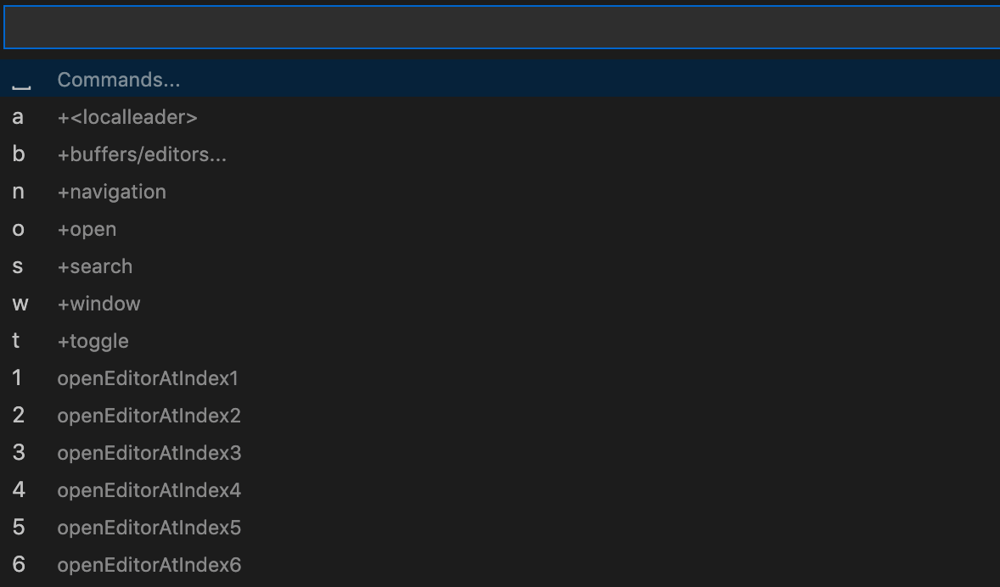

# Table of Content
- [Table of Content](#table-of-content)
- [简介](#简介)
- [速查表](#速查表)
- [如何使用我的配置?](#如何使用我的配置)
- [我对 VSCode 做了哪些配置](#我对-vscode-做了哪些配置)
  - [`ctrl + hjkl`导航栏跳](#ctrl--hjkl导航栏跳)
  - [`H,L` 替代 `^$`](#hl-替代-)
  - [j/k 会打开折叠问题的修复](#jk-会打开折叠问题的修复)
  - [markdown preview](#markdown-preview)
  - [隐藏左边活动栏大图标](#隐藏左边活动栏大图标)
  - [基于 VSCodeVim 和 Which-key 的类 Spacemacs 绑定](#基于-vscodevim-和-which-key-的类-spacemacs-绑定)
    - [如何禁用我的绑定, 使用 which-key 的绑定](#如何禁用我的绑定-使用-which-key-的绑定)
- [一些问题的解决方案](#一些问题的解决方案)
  - [vscodevim 解决英文输入法长按不打印多个字母](#vscodevim-解决英文输入法长按不打印多个字母)
  - [如何将VSCode编程绿色版本](#如何将vscode编程绿色版本)
- [插件推荐](#插件推荐)
  - [Setting Sync](#setting-sync)
  - [PasteURL](#pasteurl)
  - [PasteImage](#pasteimage)
  - [magit](#magit)
- [使用技巧 (tips and tricks)](#使用技巧-tips-and-tricks)
  - [vscode 官方 tips and tricks](#vscode-官方-tips-and-tricks)
  - [多光标操作模式(Multi-Cursor Mode)](#多光标操作模式multi-cursor-mode)
    - [如何进入多光标模式](#如何进入多光标模式)
    - [退出多光标模式](#退出多光标模式)
  - [VSCodeVim](#vscodevim)
    - [gd gq gb af gh ae,ie](#gd-gq-gb-af-gh-aeie)
    - [vim-indent-object](#vim-indent-object)
    - [vim-surround](#vim-surround)
    - [注释](#注释)
    - [easymotion](#easymotion)

# 简介

mirror-vscode 是关于 VSCode 使用过程中积累的一份备忘录.

mirror-vscode 是基于个人使用习惯的一份 VSCode 配置.

由于重度依赖 vim 的操作方式来提高编辑文本的效率, 所以 mirror-vscode 也是基于 [VSCodeVim](https://github.com/VSCodeVim/Vim) 和 [vscode-which-key](https://github.com/VSpaceCode/vscode-which-key) 的一份 vim 配置方案. 

# 速查表

[VSCodeVim 提供了 Vim 的基础功能 ROADMAP](https://github.com/VSCodeVim/Vim/blob/master/ROADMAP.md)

---

默认 Leader key 是 `<space>`, [我的快捷键速查表](cheat-sheet.md)
[Gist cloudSettings](https://gist.github.com/Imymirror/df3b3a5e832c1f3cb7423786836d6abd) : 我通过 [vscode Setting Sync](https://github.com/shanalikhan/code-settings-sync) 插件导出一份公开的配置.


# 如何使用我的配置?

如果你想直接使用我的配置, 有两种方案:

1. 使用 [Setting Sync](https://github.com/shanalikhan/code-settings-sync) 插件 : 推荐. 这种方式会将 **配置文件连同插件** 一起下载, 过程完全自动化. 只需等待一小会,环境即搭建完成 
    - 从应用商店下载 `Setting Sync` 插件 
    - `ctrl + shift + p`, `sync:Advanced Options` -> `sync:Open Settings`, `Environment Settings` 填入 我的 public Gist ID `df3b3a5e832c1f3cb7423786836d6abd`.
    - `ctrl + shift + p`, `sync: Download Setting`

2. 从公开的 [Gist cloudSettings](https://gist.github.com/Imymirror/df3b3a5e832c1f3cb7423786836d6abd) 上面复制黏贴相关配置到你的本地配置文件中(主要是 `setting.json`)

# 我对 VSCode 做了哪些配置
## `ctrl + hjkl`导航栏跳

`keybindings.json`:
```json
  {
    "key": "ctrl+h",
    "command": "workbench.action.navigateLeft"
  },
  {
    "key": "ctrl+l",
    "command": "workbench.action.navigateRight"
  },
  {
    "key": "ctrl+k",
    "command": "workbench.action.navigateUp"
  },
  {
    "key": "ctrl+j",
    "command": "workbench.action.navigateDown"
  },
```

## `H,L` 替代 `^$`

`setting.json` : 

```json
{
  "before": [
    "L"
  ],
  "after": [
    "$"
  ]
},
{
  "before": [
    "H"
  ],
  "after": [
    "^"
  ]
},
```

## j/k 会打开折叠问题的修复

```json
    // gj gk
    {
      "before": [
        "j"
      ],
      "after": [
        "g",
        "j"
      ]
    },
    {
      "before": [
        "k"
      ],
      "after": [
        "g",
        "k"
      ]
    },
```

## markdown preview

关闭 `preview 滚动的时候, Markdown 文件跟着滚动`
```json
  "markdown.preview.scrollEditorWithPreview": false,
```

## 隐藏左边活动栏大图标

左边活动栏图标太大了, 占用了不必要的视野面积. 我在 VSCode 90% 的场景下是键盘操作, 不会用到鼠标. 如果要进行 活动栏的界面导航, 使用的是 `<SPC> n + 具体窗口字幕`
```json
"workbench.activityBar.visible": false,
```

## 基于 VSCodeVim 和 Which-key 的类 Spacemacs 绑定 

安装 [VSCodeVim](https://github.com/VSCodeVim/Vim) 后, vscode就拥有了vim的基础功能. 见 [ROADMAP](https://github.com/VSCodeVim/Vim/blob/master/ROADMAP.md)

安装 [vscode-which-key](https://github.com/VSpaceCode/vscode-which-key) 之后, 就会有一份 [默认的keybinding](https://vspacecode.github.io/docs/default-keybindings).

我覆盖了 `which-key`  [默认的keybinding](https://vspacecode.github.io/docs/default-keybindings). 根据自己的习惯绑定了一份. 我会根据需要去增减 keybinding, 实际上是 `默认绑定的阉割修改版+自己的绑定`. 

### 如何禁用我的绑定, 使用 which-key 的绑定

如果想使用 **`which-key`  [默认的keybinding](https://vspacecode.github.io/docs/default-keybindings)** , 很简单, 只需要注释掉 `setting.json` 中的 `whichkey.bindings` 字段: 

```json
"whichkey.bindings": [

  // lots of keybindings here
  // ...

]
```

# 一些问题的解决方案

## vscodevim 解决英文输入法长按不打印多个字母

在 Terminal 里执行下列指令, 并重启 VSCode:
```
$ defaults write com.microsoft.VSCode ApplePressAndHoldEnabled -bool false         # For VS Code
$ defaults write com.microsoft.VSCodeInsiders ApplePressAndHoldEnabled -bool false # For VS Code Insider
$ defaults delete -g ApplePressAndHoldEnabled  
```

如果你使用的是VSCodium, 在终端执行以下语句, 重启VSCode
```
$ defaults write com.visualstudio.code.oss ApplePressAndHoldEnabled -bool false
```

## 如何将VSCode编程绿色版本

[Portable Mode in Visual Studio Code](https://code.visualstudio.com/docs/editor/portable#_migrate-to-portable-mode)

vscode 主要包含这几个部分: vscode 安装包, 扩展安装目录, keybindings.json, settings.json.

`keybindings.json, settings.json` 的位置在
```
Windows: %APPDATA%\Code\User
macOS: $HOME/Library/Application Support/Code/User
Linux: $HOME/.config/Code/User
```

VSCode 将扩展存储在 `~/.vscode/extensions`

---

第一种情况 : 从零开始配置VSCode

1. 下载压缩包
  - 下载地址 : [Download Visual Studio Code - Mac, Linux, Windows](https://code.visualstudio.com/download)
  - 下载完毕, 解压到任意文件夹

2. 创建数据文件夹(放置插件以及用户设置)
   - Mac 在 VSCode 同一层级的目录下创建文件夹 `code-portable-data`
   - Windows 在解压后的文件夹内 创建文件夹 `data`

3. 绿色版制作完成

---

第二种情况 : 在VSCode已经有配置的前提下变成绿色版

前两步都一样

1. 下载压缩包
  - 下载地址 : [Download Visual Studio Code - Mac, Linux, Windows](https://code.visualstudio.com/download)
  - 下载完毕, Windows, Linux解压到任意文件夹, Mac本身就是一个完整的压缩包

2. 创建数据文件夹(放置插件以及用户设置)
   - Mac 在 VSCode 同一层级的目录下创建文件夹 `code-portable-data`
   - Windows 在解压后的文件夹内 创建文件夹 `data`

3. 拷贝已有的插件和用户数据到数据文件夹
    - 用户数据默认路径(剪切到第2步建立的数据文件夹下, 将Code改名为data)
      ```
      Windows %APPDATA%\Code
      macOS $HOME/Library/Application Support/Code
      Linux $HOME/.config/Code
      ```
    - 插件默认路径(直接剪切到第2步建立的数据文件夹下)
      ```
      Windows %USERPROFILE%\.vscode\extensions
      macOS ~/.vscode/extensions
      Linux ~/.vscode/extensions
      ```
4. 绿色版制作完成

# 插件推荐

## Setting Sync

[Setting Sync](https://github.com/shanalikhan/code-settings-sync)

将配置上传到 Gist, 到另一台机器只需要 `Sync:Download` 下载配置, 就会下载插件, 自动化安装.

## PasteURL

[marketplace PasteURL](https://marketplace.visualstudio.com/items?itemName=kukushi.pasteurl)

在 Markdown 中使用, 复制一个 URL 到剪贴板, Hit "Command + Shift + P" and then type Paste URL and hit enter. 会在当前光标位置生成 Markdown 风格的 Link.

我绑定了快捷键 `<space> a u`

## PasteImage

[marketplace PasteImage](https://marketplace.visualstudio.com/items?itemName=mushan.vscode-paste-image)

在 Markdown 中, 使用截图工具截取屏幕到剪贴板中, `Cmd+Alt+V`, 自动将剪贴板中的截图保存到当前文件的同一层级目录的 `Image/`下.

我绑定了快捷键 `<space> a i`

## magit

Emacs 著名的 magit package 的一个替代 : [kahole/edamagit](https://github.com/kahole/edamagit) 

如果使用 VSCodeVim, 在 `keybindings.json` 加入下列配置支持 Vim:

```json
  {
    "key": "tab",
    "command": "extension.vim_tab",
    "when": "editorFocus && vim.active && !inDebugRepl && vim.mode != 'Insert' && editorLangId != 'magit'"
  },
  {
    "key": "tab",
    "command": "-extension.vim_tab",
    "when": "editorFocus && vim.active && !inDebugRepl && vim.mode != 'Insert'"
  },
  {
    "key": "x",
    "command": "magit.discard-at-point",
    "when": "editorTextFocus && editorLangId == 'magit' && vim.mode =~ /^(?!SearchInProgressMode|CommandlineInProgress).*$/"
  },
  {
    "key": "k",
    "command": "-magit.discard-at-point"
  },
  {
    "key": "-",
    "command": "magit.reverse-at-point",
    "when": "editorTextFocus && editorLangId == 'magit' && vim.mode =~ /^(?!SearchInProgressMode|CommandlineInProgress).*$/"
  },
  {
    "key": "v",
    "command": "-magit.reverse-at-point"
  },
  {
    "key": "shift+-",
    "command": "magit.reverting",
    "when": "editorTextFocus && editorLangId == 'magit' && vim.mode =~ /^(?!SearchInProgressMode|CommandlineInProgress).*$/"
  },
  {
    "key": "shift+v",
    "command": "-magit.reverting"
  },
  {
    "key": "shift+o",
    "command": "magit.resetting",
    "when": "editorTextFocus && editorLangId == 'magit' && vim.mode =~ /^(?!SearchInProgressMode|CommandlineInProgress).*$/"
  },
  {
    "key": "shift+x",
    "command": "-magit.resetting"
  },
  {
    "key": "x",
    "command": "-magit.reset-mixed"
  },
  {
    "key": "ctrl+u x",
    "command": "-magit.reset-hard"
  }
```

# 使用技巧 (tips and tricks)

## vscode 官方 tips and tricks

https://code.visualstudio.com/docs/getstarted/tips-and-tricks

## 多光标操作模式(Multi-Cursor Mode) 

### 如何进入多光标模式

第一种方法:
1. 选中字符
2. cmd+d 或者 gb

第二种方法:
1. alt + shift + 鼠标移动

### 退出多光标模式

Esc 退回,`normal multi-cursor`模式,再按一次 Esc 就会退出多光标模式.


## VSCodeVim

### gd gq gb af gh ae,ie

- gd : 跳到定义
- gq : 合并多行注释
- gb : 移动到下一个单词, 跟当前光标所在的单词一样
- af : visual mode 下不断选中更大的文本块
- gh : 将鼠标悬停在贯标所在位置
- ae, ie : 选中buffer所有文本

### vim-indent-object 

`cib/ci{/ci[/cit`

### vim-surround

- "test" with cursor inside quotes type cs"' to end up with 'test'
- "test" with cursor inside quotes type ds" to end up with test
- "test" with cursor inside quotes type cs"t and enter `123>` to end up with `<123>test</123>`

`S <desired char>` :  Surround when in visual modes (surrounds full selection)

### 注释

`gcc` : 注释当前行
`gc2j` : 往下注释两行
`gci)` : 注释括号之间的内容

###  easymotion

|   key   |       Description       |
| :-----: | :---------------------: |
| gs<SPC> | Search by one character |
|   gsj   | Start of line forwards  |
|   gsk   | Start of line backwards |
|   gsw   | Start of word forwards  |
|   gsb   | Start of word backwards |